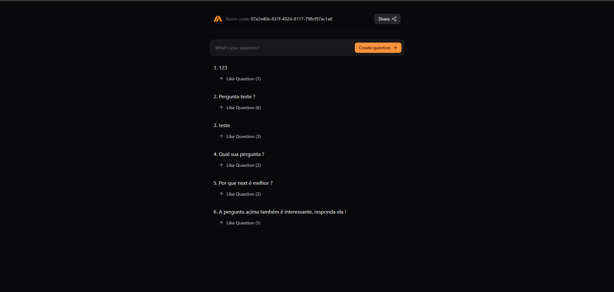

# Letmeask - The Ultimate Q&A Platform for Engaging with Your Audience 🎤

<br>

<p align="center">
  <a href="#-about-the-project">About the project</a> •
  <a href="#-technologies">Technologies</a> •
<a href="#-getting-started">Getting started</a> •
<a href="#-license">License</a>

</p>

<p align="center">
 
 <kbd>
  </kbd>

</p>

## 👩‍💻 About the project

Letmeask is perfect for content creators to create Q&A rooms with their audience in a very organized and democratic way.

Simply create a room, then share the code with your viewers. They can join the room to ask questions and upvote the best ones!

Built with cutting-edge technologies like React, React Query, Vite, and Tailwind on the frontend, Letmeask ensures a smooth and responsive experience. On the backend, it's powered by GOlang and utilizes WebSockets to enhance real-time interaction performance.`

## 🚀 Technologies

- [go](https://go.dev/)
- [Postgresql](https://www.postgresql.org/)
- [React 19](https://react.dev/)
- [Tailwind Css](https://tailwindcss.com/)
- [vite](https://vitejs.dev/)

## 💻 Getting started

### Requirements

- [Node.js](https://nodejs.org/en/)
- [Yarn](https://classic.yarnpkg.com/) or [PNPM](https://pnpm.io/) _(examples are with PNPM)_
- [go](https://go.dev/)

### Running the Project

To run the application, you will need to start the server in the `/go-server` folder and the web application in the `/react-web` folder.

**Start by accessing the server folder in your terminal:**

```bash
$ cd go-server
```

**To run the back-end application, follow these steps:**

To ensure the back-end application runs correctly, you need to configure your PostgreSQL database. If you have PostgreSQL installed on your machine, create a database named `wsrs` with the username `postgres` and password `123456789`. After creating the database, run the migrations to set up the schema.Alternatively, you can modify the database configuration in the .env file according to your setup.

For convenience, you can also use Docker to set up the database. The docker-compose.yml file is pre-configured for this purpose. Simply run: `docker compose up`

Once everything is set up, start the server with the following command:

```bash
$ go run cmd/wsrs/main.go
```

**To run the front-end, follow these steps:**

Keep the GO server running, open a new terminal, and access the `react-web` folder:

```bash
# Access the front-end folder
$ cd react-web

# Install the project dependencies
$ pnpm i

# Start the application
$ pnpm run dev

# Your front-end will be available at http://localhost:3000/
```

## 📝 License

This project is licensed under the MIT License - see the [LICENSE](LICENSE) file for details.

---

<p align="center">
  Made with 💜&nbsp; by  Leandro Rodrigues
</p>
